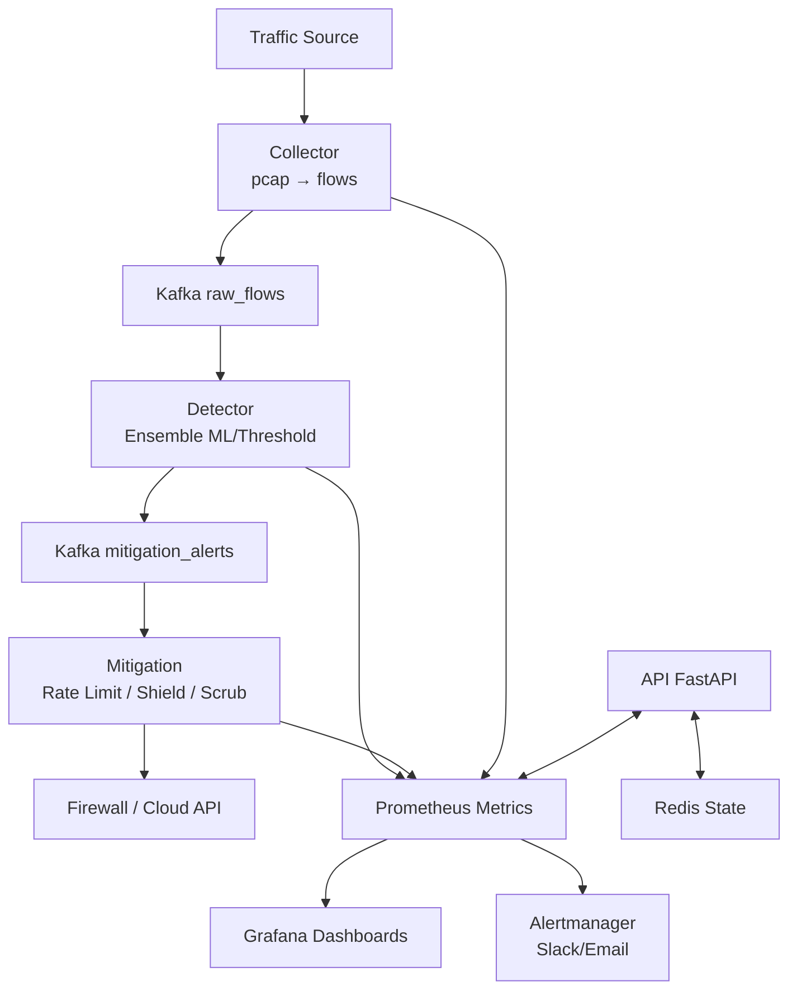
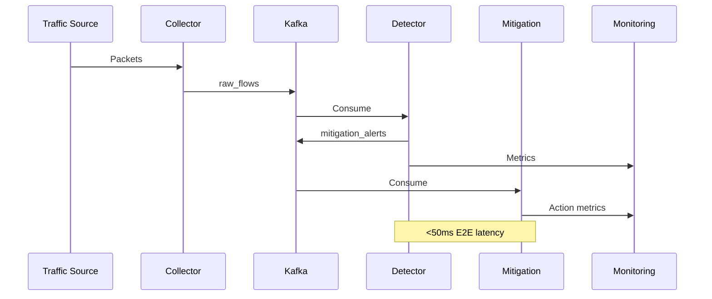
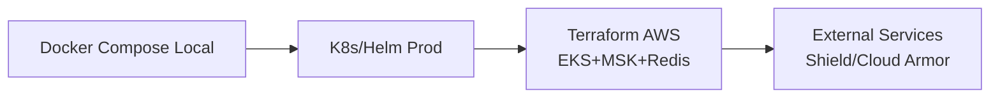

# Overall System Architecture

Comprehensive visual and textual representation of the DDoS Detection & Mitigation System.

## Mermaid Component Diagram

## Mermaid Data Flow Sequence

## Deployment Stack

## Key Technologies

| Layer | Tech |
|-------|------|
| Messaging | Kafka (TLS) |
| Cache/State | Redis (TLS) |
| Monitoring | Prometheus + Grafana + Alertmanager |
| ML | XGBoost + Isolation Forest |
| API | FastAPI |
| Deployment | Docker, Helm, Terraform |

Links: [ARCHITECTURE.md](ARCHITECTURE.md), [Folder Structure](FOLDER_STRUCTURE.txt)
